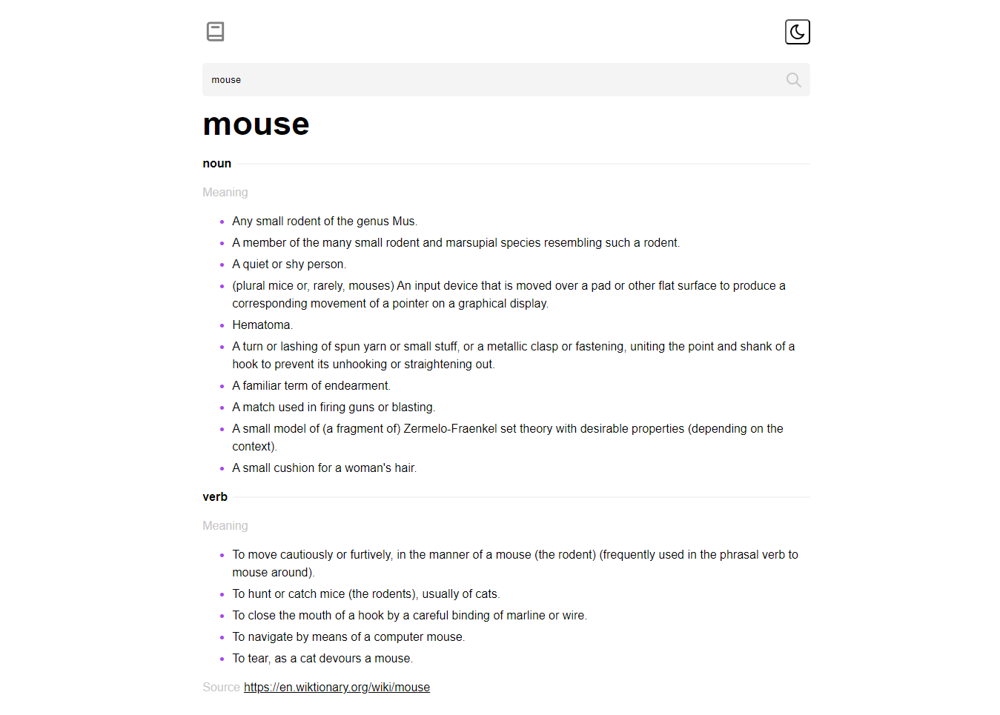

# React Dictionary



The React Dictionary project is a comprehensive dictionary web application built using React. This application allows users to search for words and terms, returning detailed information including meanings, pronunciations, examples, and more. It's a robust tool for language enthusiasts and learners.

## Table of Contents
- [Features](#features)
- [Getting Started](#getting-started)
  - [Prerequisites](#prerequisites)
  - [Installation](#installation)
- [Usage](#usage)
- [Technical Details](#technical-details)
- [Contributing](#contributing)
- [License](#license)

## Features

- **Word Search**: Users can search for words or terms.
- **Detailed Information**: Retrieve comprehensive word information, including meanings, pronunciations, examples, and more.
- **Audio Pronunciation**: Listen to correct word pronunciations.
- **Categorization**: Categorize words based on their types.
- **User-Friendly Interface**: A clean and intuitive design.

## Getting Started

These instructions will help you set up and run the project on your local machine.

### Prerequisites

To run the project, you need the following software and tools:

- [Node.js](https://nodejs.org/) - To manage project dependencies.
- [npm](https://www.npmjs.com/) or [Yarn](https://yarnpkg.com/) - Package manager.

### Installation

1. Clone the project:

   ```shell
   git clone https://github.com/tncrayt/react-dictionary.git
   ```

2. Navigate to the project directory:

   ```shell
   cd react-dictionary
   ```

3. Install project dependencies:

   ```shell
   npm install
   ```

   or

   ```shell
   yarn install
   ```

4. Start the application:

   ```shell
   npm start
   ```

   or

   ```shell
   yarn start
   ```

   These commands will run the application on your local development server, and you can access it in your default web browser.

## Usage

Upon starting the application, users can search for a word or term, triggering a request to the dictionary API. The application will then display detailed word information, including meanings, pronunciations, examples, and more. The clean and user-friendly interface ensures a seamless experience.

## Technical Details

The application is built with React, making use of React state management for user interactions. It interfaces with a dictionary API to retrieve word data dynamically. The use of modern web development techniques ensures efficient and responsive functionality.

## Contributing

This project is open-source, and contributions are encouraged. If you encounter bugs, have feature requests, or wish to contribute in any way, please open an issue or submit a pull request.

## License

This project is licensed under the MIT License. See the [LICENSE](LICENSE) file for details.
